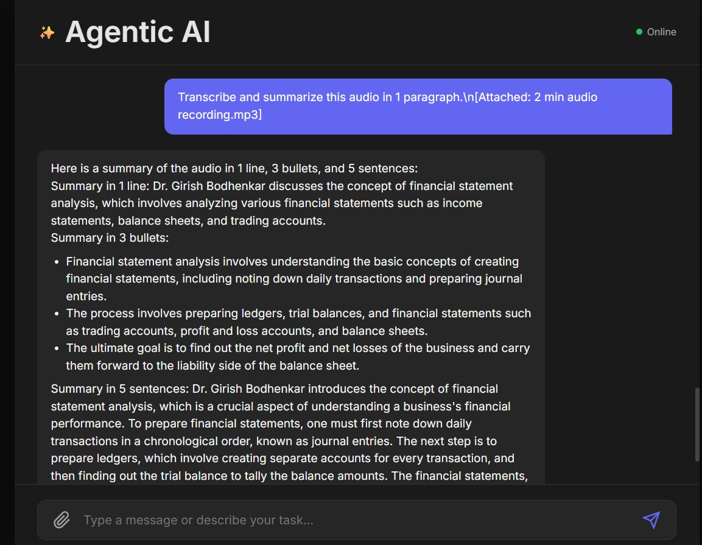
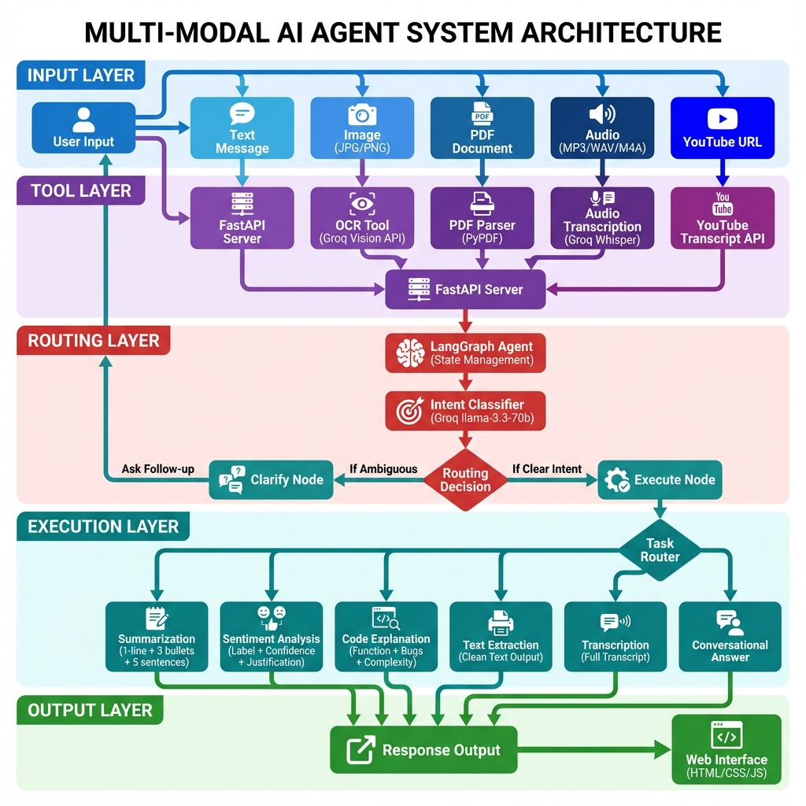

# Agentic AI Assistant

A production-ready autonomous AI agent built with LangGraph and FastAPI that accepts multi-modal inputs (Text, Images, PDFs, Audio) and autonomously performs tasks with intelligent routing and follow-up questions.

## Table of Contents

- [Overview](#overview)
- [Architecture](#architecture)
- [Features](#features)
- [Tech Stack](#tech-stack)
- [Installation](#installation)
- [Usage](#usage)
- [API Documentation](#api-documentation)
- [Supported Tasks](#supported-tasks)
- [Testing](#testing)
- [Project Structure](#project-structure)
- [Requirements Met](#requirements-met)

---

## Overview

This application is an autonomous agentic system that:
- Accepts multi-modal inputs (Text, Images, PDFs, Audio files)
- Automatically extracts or transcribes content
- Identifies user intent using LangGraph conditional routing
- Asks clarifying follow-up questions when needed
- Executes appropriate tasks autonomously
- Returns text-only outputs

Built for the DataSmith AI Gen AI position assignment.

### Demo



---

## Architecture

### System Architecture Diagram



The architecture consists of five distinct layers:

### LangGraph Conditional Routing

The agent uses LangGraph's conditional edges instead of if-else logic:

```python
workflow.add_conditional_edges(
    "classify",
    classification_route,
    {
        "clarify": "clarify",
        "execute": "execute"
    }
)
```

This ensures:
- No manual if-else branching
- Autonomous decision-making
- Clean, maintainable agent logic

### Agent State Flow

```
AgentState {
  user_message: str
  file_path: Optional[str]
  extracted_content: Optional[str]
  intent: str  // "summarize", "sentiment", "code_explain", "chat", "ambiguous"
  missing_info: Optional[str]
  agent_response: str
  action_taken: str
}
```

### Architecture Layers

**1. Input Layer (Blue)**
- Multi-modal user inputs: Text, Images, PDFs, Audio, YouTube URLs
- Handles various file formats and content types

**2. Tool Layer (Purple)**
- FastAPI server for request handling
- Specialized extraction tools: OCR, PDF Parser, Whisper, YouTube API
- Content preprocessing and normalization

**3. Routing Layer (Red)**
- LangGraph state management
- Intent classification using Groq LLM
- Autonomous decision-making logic

**4. Execution Layer (Teal)**
- Task-specific processors
- Clarification handler for ambiguous inputs
- Multiple specialized agents for different tasks

**5. Output Layer (Green)**
- Unified response formatting
- Web UI for user interaction
- Clean text-only outputs

---

## Features

### Multi-Modal Input Support

1. **Text Input**
   - Direct message input via chat interface
   - Conversational Q&A

2. **Image Input (JPG/PNG)**
   - OCR using Groq Vision API (llama-3.2-11b-vision-preview)
   - Supports 50+ languages
   - Text extraction from screenshots, documents, code snippets

3. **PDF Input**
   - Text-based PDF parsing using PyPDF
   - Automatic text extraction
   - Support for multi-page documents

4. **Audio Input (MP3/WAV/M4A)**
   - Speech-to-text using Groq Whisper (whisper-large-v3)
   - Supports 99+ languages with automatic detection
   - High-quality transcription

5. **YouTube URLs**
   - Automatic transcript fetching
   - Supports videos with captions enabled

### Autonomous Agent Behavior

1. **Intent Classification**
   - Automatically determines task type
   - Routes to appropriate execution node
   - No manual if-else branching

2. **Mandatory Follow-Up Questions**
   - Detects ambiguous inputs
   - Asks clarifying questions
   - Only proceeds after receiving clarity

3. **Task Execution**
   - Summarization (1-line + 3 bullets + 5 sentences)
   - Sentiment Analysis (Label + Confidence + Justification)
   - Code Explanation (Functionality + Bugs + Complexity)
   - Conversational Answering
   - Text Extraction
   - Audio Transcription

### User Interface

- Clean, minimal chat interface
- File upload support
- Text-only outputs
- Collapsible "View Extracted Content" section
- Dark theme for reduced eye strain
- Responsive design

---

## Tech Stack

### Backend
- **Framework**: FastAPI
- **Agent Orchestration**: LangGraph
- **LLM**: Groq llama-3.3-70b-versatile
- **Vision/OCR**: Groq llama-3.2-11b-vision-preview
- **Audio**: Groq Whisper-large-v3
- **PDF Parser**: PyPDF
- **YouTube**: youtube-transcript-api

### Frontend
- **HTML/CSS/JavaScript** (Vanilla)
- **Markdown Rendering**: Marked.js

### Key Libraries
- langchain-groq
- langgraph
- groq
- fastapi
- uvicorn
- pypdf
- pillow

---

## Installation

### Prerequisites

- Python 3.8+
- pip
- Virtual environment (recommended)

### Step 1: Clone Repository

```bash
git clone https://github.com/YOUR_USERNAME/agentic-ai-assistant.git
cd agentic-ai-assistant
```

### Step 2: Set Up Environment

```bash
cd backend
python -m venv venv
```

**Windows:**
```bash
venv\Scripts\activate
```

**Linux/Mac:**
```bash
source venv/bin/activate
```

### Step 3: Install Dependencies

```bash
pip install -r requirements.txt
```

### Step 4: Configure Environment Variables

Create a `.env` file in the `backend/` directory:

```env
GROQ_API_KEY=your_groq_api_key_here
GROQ_MODEL=llama-3.3-70b-versatile
GROQ_VISION_MODEL=llama-3.2-11b-vision-preview
```

Get your Groq API key from: https://console.groq.com

### Step 5: Run Application

```bash
uvicorn main:app --reload
```

The application will be available at: http://127.0.0.1:8000

---

## Usage

### Starting the Server

```bash
cd backend
uvicorn main:app --reload
```

### Accessing the UI

Open your browser and navigate to:
```
http://127.0.0.1:8000
```

### Example Interactions

1. **PDF Summarization**
   - Upload a PDF file
   - Type: "summarize this pdf"
   - Receive: 1-line + 3 bullets + 5 sentences summary

2. **Image OCR**
   - Upload a screenshot with text
   - Type: "extract text from this image"
   - Receive: Extracted text content

3. **Sentiment Analysis**
   - Type: "Analyze sentiment: This product is amazing!"
   - Receive: Label (Positive) + Confidence (0.95) + Justification

4. **Code Explanation**
   - Type: "Explain this code:" followed by code snippet
   - Receive: Functionality + Bugs + Time Complexity

5. **Audio Transcription**
   - Upload MP3/WAV audio file
   - Type: "Transcribe this audio"
   - Receive: Full transcript + summary

6. **Follow-Up Flow**
   - Upload PDF without instruction
   - Agent asks: "What would you like me to do with this?"
   - Reply: "summarize it"
   - Receive: Summary

---

## API Documentation

### Endpoints

#### 1. GET /
- **Description**: Redirects to static frontend
- **Response**: 307 Temporary Redirect

#### 2. POST /api/chat
- **Description**: Main chat endpoint for agent interaction
- **Request Body**:
  ```json
  {
    "message": "string",
    "file_path": "string (optional)"
  }
  ```
- **Response**:
  ```json
  {
    "response": "string",
    "action": "string",
    "extracted_content": "string (optional)"
  }
  ```

#### 3. POST /api/upload
- **Description**: File upload endpoint
- **Request**: multipart/form-data with file
- **Response**:
  ```json
  {
    "filename": "string",
    "filepath": "string",
    "content_type": "string"
  }
  ```

---

## Supported Tasks

### 1. Summarization
**Input**: Any text, PDF, or audio
**Output**:
- 1-line summary
- 3 bullet points
- 5-sentence detailed summary

### 2. Sentiment Analysis
**Input**: Text expressing opinion
**Output**:
- Label (Positive/Negative/Neutral)
- Confidence score (0.0 - 1.0)
- One-line justification

### 3. Code Explanation
**Input**: Code snippet
**Output**:
- What the code does
- Potential bugs
- Time complexity

### 4. Text Extraction
**Input**: Image or PDF
**Output**:
- Cleaned extracted text

### 5. Audio Transcription
**Input**: MP3/WAV/M4A file
**Output**:
- Full transcript
- Optional summary

### 6. YouTube Transcript
**Input**: YouTube URL
**Output**:
- Video transcript
**Note**: Requires video to have captions enabled

### 7. Conversational Answering
**Input**: General questions
**Output**:
- Helpful, friendly responses

---

## Testing

### Test Cases

The application includes comprehensive test cases in `test_cases.md`:

1. PDF Summarization - Verified Working
2. Image OCR - Verified Working
3. Audio Transcription - Verified Working
4. Sentiment Analysis - Ready
5. Code Explanation - Ready
6. Follow-up Question Flow - Ready
7. YouTube Transcripts - Requires videos with captions

### Running Tests

```bash
# Test server startup
uvicorn main:app --reload

# Test in browser
# 1. Navigate to http://127.0.0.1:8000
# 2. Try sample inputs from test_cases.md
```

---

## Project Structure

```
agentic-app/
├── backend/
│   ├── agent/
│   │   ├── __init__.py
│   │   ├── state.py          # Agent state definition
│   │   └── graph.py          # LangGraph workflow
│   ├── tools/
│   │   ├── __init__.py
│   │   ├── ocr.py            # PDF + Image OCR
│   │   ├── audio.py          # Audio transcription
│   │   └── youtube.py        # YouTube transcripts
│   ├── main.py               # FastAPI application
│   ├── requirements.txt      # Python dependencies
│   ├── .env                  # Environment variables (not in repo)
│   └── RUN.bat              # Windows startup script
├── frontend/
│   ├── index.html           # Main UI
│   ├── style.css            # Styling
│   └── app.js               # Frontend logic
├── .gitignore
├── README.md
├── architecture.md          # System architecture
└── test_cases.md           # Test scenarios
```

---

## Requirements Met

This project fulfills all assignment requirements:

### 1. Inputs Supported
- [x] Text
- [x] Image (JPG/PNG) with OCR
- [x] PDF with parsing
- [x] Audio (MP3/WAV/M4A) with transcription

### 2. Agent Behavior
- [x] Intent understanding
- [x] Mandatory follow-up questions
- [x] Autonomous task execution
- [x] LangGraph conditional routing (no if-else)

### 3. Tasks Implemented
- [x] Text Extraction
- [x] YouTube Transcripts
- [x] Conversational Answering
- [x] Summarization (3 formats)
- [x] Sentiment Analysis
- [x] Code Explanation
- [x] Audio Transcription

### 4. UI Requirements
- [x] Text box
- [x] File upload
- [x] Clean, minimal UI
- [x] Text-only output
- [x] Extracted content viewer
- [x] Chat-like interface

### 5. Deliverables
- [x] Clean codebase
- [x] Architecture diagram
- [x] FastAPI backend
- [x] Simple UI
- [x] Test cases
- [x] Comprehensive README

### 6. Evaluation Criteria
- Correctness: All core tasks produce correct outputs
- Autonomy: LangGraph handles routing without if-else
- Robustness: Error handling and state management
- Explainability: Clear architecture and documentation
- Code Quality: Modular, maintainable structure
- UX: Working UI with file upload and chat

---

## Language Support

### Audio Transcription
Supports 99+ languages with automatic detection:
- English, Spanish, French, German, Italian, Portuguese
- Chinese, Japanese, Korean, Hindi, Arabic, Russian
- And 90+ more languages

### Image OCR
Supports 50+ languages:
- All Latin script languages
- Chinese, Japanese, Korean
- Arabic, Hebrew, Hindi, Thai
- Cyrillic scripts (Russian, Ukrainian, etc.)

---

## Troubleshooting

### Server Won't Start

```bash
cd backend
pip install -r requirements.txt
uvicorn main:app --reload
```

### Missing Dependencies

```bash
pip install fastapi uvicorn langchain-groq langgraph groq pypdf youtube-transcript-api
```

### Environment Variables Not Loading

Ensure `.env` file is in `backend/` directory with:
```
GROQ_API_KEY=your_key_here
GROQ_MODEL=llama-3.3-70b-versatile
GROQ_VISION_MODEL=llama-3.2-11b-vision-preview
```

### YouTube Transcripts Not Working

Some videos don't have captions. Try a different video with captions enabled.

---

## License

This project was created for the DataSmith AI Gen AI position assignment.

---

## Author

Praveen Agrawal
- Email: agrawalpraveen86539@gmail.com
- GitHub: https://github.com/agrawalpraveen12
- LinkedIn: https://www.linkedin.com/in/praveenagrawal220/

---

## Acknowledgments

- Groq for LLM, Vision, and Audio APIs
- LangGraph for agent orchestration
- FastAPI for backend framework
